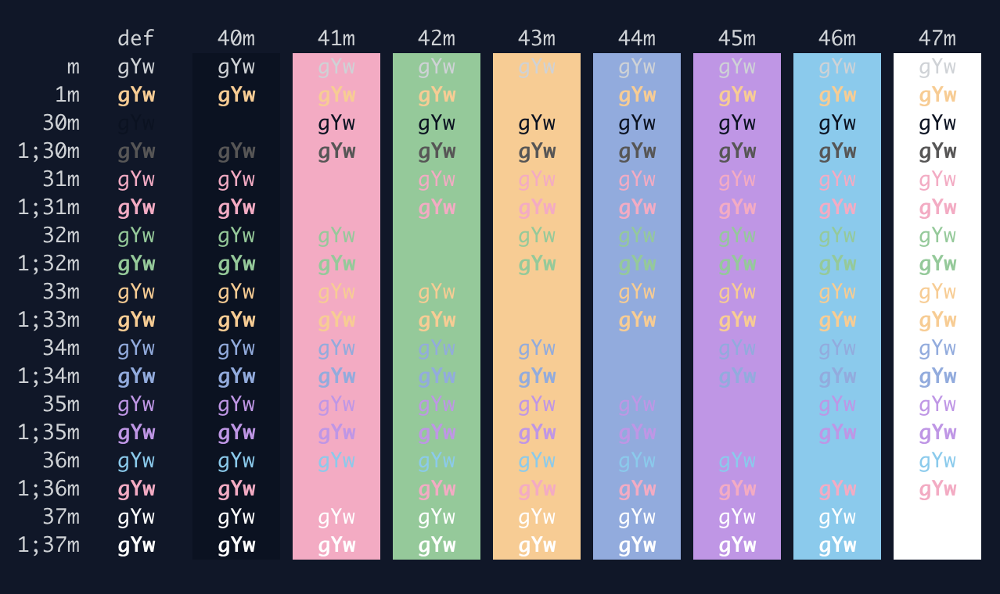

# Overnight Slumber for iTerm2

A port of the [VS Code Overnight Slumber theme](https://github.com/cevr/overnight) for iTerm2.

## Installation

1. [Download Overnight Slumber for iTerm2](https://github.com/gomah/overnight-slumber-iterm/archive/master.zip).
2. Install [iTerm2](https://www.iterm2.com/).
3. Launch iTerm2.
4. Press <kbd>Cmd</kbd>+<kbd>,</kbd> to open preferences.
5. Visit Profiles → [Your Profile Name] → Colors.
6. Choose “Import…” from the “Color Presets” drop-down.
7. Import the `Overnight Slumber.itermcolors` file.
8. Choose Overnight Slumber from the Color Presets.
9. Repeat step eight for each profile you’d like to use Overnight Slumber for.

## Updating

1. [Download Overnight Slumber for iTerm2](https://github.com/gomah/overnight-slumber-iterm/archive/master.zip).
2. Open iTerm2.
3. Visit Profiles → [Your Profile] → Colors.
4. Choose “Delete Preset…” from the “Color Presets” drop-down.
5. Delete the Overnight Slumber preset.
6. Choose “Import…” from the “Color Presets” drop-down.
7. Import the `Overnight Slumber.itermcolors` file.
8. Choose Overnight Slumber from the Color Presets.
